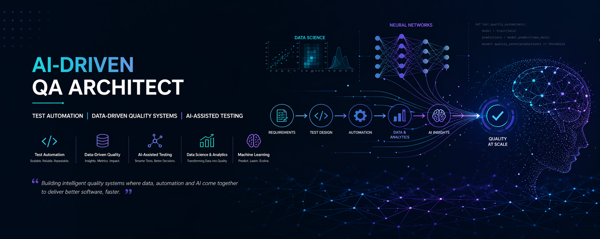
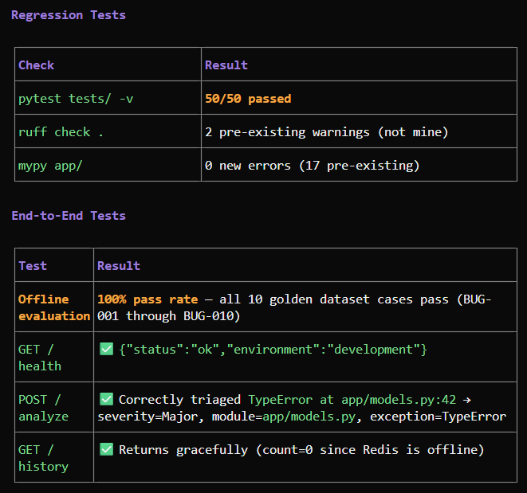

# Auto-QA Agent Insights

An enterprise-grade, production-ready AI Engineering framework designed to automate software bug triage, root-cause analysis (RCA), and remediation proposals using Context-Driven Architecture.

## System Architecture Overview

The framework avoids fragile, unstructured conversational loops by implementing a deterministic, sequential multi-agent processing pipeline protected by security and quality guardrails.

```text
[Raw Bug Report] -> [Input Guard] -> [Query Rewriter] -> [Semantic Cache (Redis)] -?-> [FAISS Vector Search + BM25 Fallback] -> [Rerank]
                                                                                          │ (cache miss)
[Enriched Report] <- [Output Filter] <- [Document Grader] <- [Code Forensics Agent]
       │
       └──> [Cache Store (Redis, 24h TTL)]
```

### Vector Store (FAISS)

Historical bug records are indexed into a FAISS vector store on startup using `all-MiniLM-L6-v2` embeddings (384-dim). The `hybrid_retriever` performs semantic vector search as the primary retrieval strategy, falling back to BM25 keyword scoring when FAISS confidence is below 0.70. The index is seeded from `evaluation/golden_dataset.json` — 10 curated bug-diagnostic pairs.

## Key Architectural Pillars

- Context-Driven Design: The system's rules, agents, and tool signatures are explicitly declared in Markdown specifications (CONTEXT.md, AGENTS.md, SKILLS.md) before implementation, ensuring high alignment and minimal token waste.
- Surgical Code Forensics: Rather than saturating context windows with whole source files, specialized tools target exact line ranges extracted from stack traces.
- Deterministic Quality Gates: An internal Document Grader evaluates context relevance before generation, applying a hard circuit-breaker to prevent LLM hallucinations.
- Enterprise Security & Observability: Out-of-the-box input/output sanitization filters combined with dynamic token cost-tracking per evaluation cycle.

## Project Structure

```text
auto-qa-agent-insights/
├── app/
│   ├── main.py                 # FastAPI entry point with /health
│   ├── config.py               # Pydantic Settings (env vars)
│   ├── models.py               # Strict Pydantic data schemas (SKILLS.md contracts)
│   ├── components/
│   │   ├── vector_store.py     # FAISS vector index (sentence-transformers + faiss-cpu)
│   │   ├── hybrid_retriever.py # FAISS + BM25 fallback search (SKILLS.md §1.1)
│   │   └── reranker.py         # Cross-encoder context reranking (SKILLS.md §1.2)
│   ├── services/
│   │   ├── query_rewriter.py   # Strips noise from raw logs (SKILLS.md §3.1)
│   │   ├── semantic_cache.py   # Redis-backed cache with vector distance (SKILLS.md §3.2)
│   │   └── query_router.py     # State machine connecting agents (AGENTS.md §5)
│   ├── agents/
│   │   ├── triage_agent.py     # Severity classification, module extraction
│   │   ├── rca_agent.py        # Code forensics, failure pinpointing
│   │   ├── remediation_agent.py# Patch generation
│   │   ├── grader_agent.py     # Relevance scoring gate
│   │   └── tools/
│   │       └── code_search.py  # Surgical file line scanning (SKILLS.md §2)
│   └── security/
│       ├── input_guard.py      # Prompt injection detection
│       └── output_filter.py    # Structured output validation
├── evaluation/
│   ├── golden_dataset.json     # 10 curated bug-diagnostic pairs
│   └── offline_eval.py         # Runs pipeline against dataset, reports metrics
├── observability/
│   └── cost_tracker.py         # Token usage estimation & JSONL logging
├── tests/
│   ├── test_vector_store.py    # FAISS vector store indexing & search tests
│   ├── test_retrieval.py       # Rewriter, retriever, reranker tests
│   ├── test_agents.py          # All 4 agent runtime tests
│   ├── test_security.py        # Input guard & output filter tests
│   └── test_api.py             # API endpoint integration tests
├── .github/
│   └── workflows/
│       ├── ci.yml              # Lint, typecheck, test, evaluate on push/PR
│       └── publish.yml         # Build & publish to PyPI on tagged releases
├── CONTEXT.md                  # Business domain & glossary
├── AGENTS.md                   # Agent personas & system prompts
├── SKILLS.md                   # JSON contracts for every tool
├── CORE.md                     # Engineering methodology (CDD)
├── PLAN.md                     # Iteration roadmap
├── Dockerfile
├── docker-compose.yml
├── pyproject.toml
├── .env.example
└── .gitignore
```

## Prerequisites

- Python >= 3.11
- pip or uv
- Redis 7+ (or `docker compose up redis`)

## Quick Start

### 1. Install

```bash
# Using pip
pip install -e ".[dev]"

# Or using uv
uv sync --dev
```

### 2. Configure Environment

```bash
cp .env.example .env
# Then edit .env with your values:
#   ENVIRONMENT=development
#   OPENAI_API_KEY=your_key_here
#   LLM_MODEL=gpt-4o-mini
#   REDIS_URL=redis://localhost:6379/0
```

### 3. Run Unit Tests (25 tests)

```bash
pytest tests/ -v
```

### 4. Run Offline Evaluation (10 golden dataset cases)

```bash
# With pip:
PYTHONPATH=. python3 evaluation/offline_eval.py

# With uv:
uv run python3 evaluation/offline_eval.py
```

Expected output:

```bash
  Total cases:  10
  Passed:       10
  Pass rate:    100%
  Severity accuracy:  100%
  Module hit rate:    100%
  Exception accuracy: 100%
```

### 5. Test the Full Pipeline End-to-End

```bash
uv run python3 -c "
from app.models import RawBugReport
from app.services.query_router import process

# Test with a real project file
report = RawBugReport(payload='TypeError at app/models.py:42: unsupported operand type for NoneType')
result = process(report)
print(result)
"
```

### 6. Start the API Server

```bash
uvicorn app.main:app --reload
```

Then in another terminal:

```bash
curl localhost:8000/health
# {"status":"ok","environment":"development"}
```

### 7. Docker (optional)

```bash
cp .env.example .env
docker compose up --build
```

### 8. Run CI Pipeline Locally (optional)

```bash
ruff check .
mypy app/
pytest tests/ -v
uv run python3 evaluation/offline_eval.py
```

## API Endpoints

### `POST /analyze`

Accepts a raw bug report and runs the full triage → RCA → remediation pipeline.

```bash
curl -X POST localhost:8000/analyze \
  -H "Content-Type: application/json" \
  -d '{"payload": "TypeError at app/models.py:42: unsupported operand type for NoneType"}'
```

**Response** (200): `EnrichedInsightReport` with triage, root-cause, and remediation.
**Error** (422): Input rejected, insufficient context, or output filter failure.

### `GET /history?limit=20`

Returns recent cached analyses (Redis-backed, last 100 entries).

```bash
curl "localhost:8000/history?limit=5"
```

**Response** (200): `{"results": [...], "count": 5}`

## Project Specification Documents

| Document | Purpose |
| ---------- | --------- |
| `CONTEXT.md` | Business domain, glossary, success criteria |
| `AGENTS.md` | Agent personas, system prompts, capability contracts |
| `SKILLS.md` | Input/output JSON schemas for every tool |
| `CORE.md` | Engineering methodology (CDD, determinism, golden dataset) |
| `PLAN.md` | Iteration roadmap with task tracking |

## Regression Test and E2E Tests


